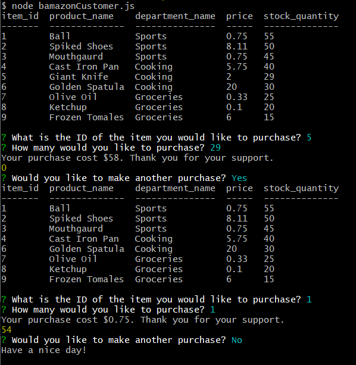
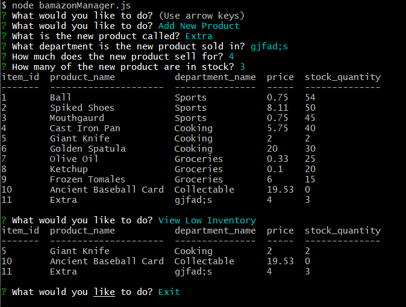

# CLI Storefront #
Uses a database to track item quantities across multiple purchases.

## Get Started ##
1. Clone this repository
    1. Change Directory into it
2. Use npm install
3. Create the database and table
    1. Use MySQL Workbench to run create-products-table.sql
4. Use node or nodemon to run bamazonCustomer.js or bamazonManager.js

- - - -
## An Example Purchase ##

## An Example New Product ##

